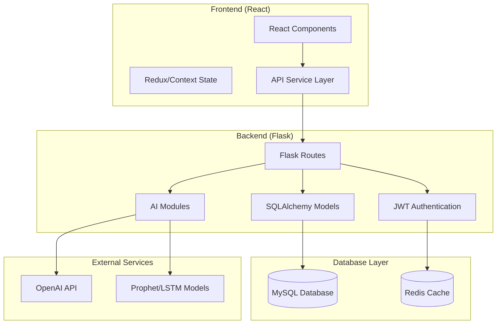

# AI-Integrated SCM Application Design Document

## Overview

This design document outlines the architecture for an AI-integrated Supply Chain Management application using Flask (backend), React (frontend), and MySQL (database). The system incorporates AI/ML capabilities for demand forecasting and intelligent chatbot assistance, following modern web application patterns with RESTful APIs and responsive design.

## Architecture

### High-Level Architecture



### Technology Stack

**Backend:**
- Flask 2.3+ with Flask-RESTful
- SQLAlchemy ORM with Flask-SQLAlchemy
- Flask-JWT-Extended for authentication
- Flask-CORS for cross-origin requests
- MySQL 8.0+ database
- Redis for session management and caching

**Frontend:**
- React 18+ with functional components and hooks
- Material-UI or Ant Design for UI components
- Axios for API communication
- React Router for navigation
- Chart.js or Recharts for data visualization

**AI/ML Stack:**
- OpenAI GPT API for chatbot functionality
- Prophet for time series forecasting
- TensorFlow/Keras for LSTM models
- Pandas and NumPy for data processing
- Scikit-learn for additional ML utilities

## Components and Interfaces

### Backend Components

#### 1. Flask Application Structure
```
backend/
├── app.py                      # Main Flask application
├── db.py                       # Database initialization
├── .env                        # Environment variables
├── requirements.txt            # Python dependencies
├── models/
│   ├── __init__.py
│   ├── user.py                 # User model
│   ├── item.py                 # Inventory items
│   ├── order.py                # Orders/transactions
│   └── forecast.py             # AI predictions storage
├── routes/
│   ├── __init__.py
│   ├── auth.py                 # Authentication routes
│   ├── inventory.py            # Inventory CRUD
│   ├── orders.py               # Order management
│   └── ai.py                   # AI/ML routes
├── ai_modules/
│   ├── __init__.py
│   ├── chatbot/
│   │   └── chatbot_handler.py  # OpenAI SCM chatbot
│   ├── demand_forecasting/
│   │   ├── forecast_model.py   # Prophet/LSTM models
│   │   └── data_preprocessing.py
│   └── shared/
│       └── utils.py            # Common ML utilities
└── utils/
    ├── __init__.py
    ├── auth_decorators.py      # JWT decorators
    └── response_helpers.py
```

#### 2. API Endpoints Design

**Authentication Endpoints:**
- `POST /api/auth/register` - User registration
- `POST /api/auth/login` - User login
- `POST /api/auth/logout` - User logout
- `GET /api/auth/profile` - Get user profile

**Inventory Management:**
- `GET /api/inventory` - List inventory items (with pagination/filtering)
- `POST /api/inventory` - Create new inventory item
- `GET /api/inventory/{id}` - Get specific inventory item
- `PUT /api/inventory/{id}` - Update inventory item
- `DELETE /api/inventory/{id}` - Delete inventory item
- `GET /api/inventory/alerts` - Get low-stock alerts

**Order Management:**
- `GET /api/orders` - List orders (with filtering)
- `POST /api/orders` - Create new order
- `GET /api/orders/{id}` - Get specific order
- `PUT /api/orders/{id}` - Update order status
- `DELETE /api/orders/{id}` - Cancel order

**AI/ML Endpoints:**
- `POST /api/ai/forecast` - Generate demand forecast
- `GET /api/ai/forecast/{item_id}` - Get forecast for specific item
- `POST /api/ai/chatbot` - Chatbot conversation
- `GET /api/ai/chatbot/history` - Get chat history

### Frontend Components

#### 1. React Application Structure
```
frontend/
├── public/
│   └── index.html
├── src/
│   ├── components/
│   │   ├── common/
│   │   │   ├── Sidebar.jsx
│   │   │   ├── Header.jsx
│   │   │   └── LoadingSpinner.jsx
│   │   ├── inventory/
│   │   │   ├── InventoryTable.jsx
│   │   │   ├── InventoryForm.jsx
│   │   │   └── StockAlerts.jsx
│   │   ├── orders/
│   │   │   ├── OrderForm.jsx
│   │   │   ├── OrderList.jsx
│   │   │   └── OrderDetails.jsx
│   │   ├── ai/
│   │   │   ├── ChatBot.jsx
│   │   │   ├── ForecastChart.jsx
│   │   │   └── AIInsights.jsx
│   │   └── charts/
│   │       ├── LineChart.jsx
│   │       └── BarChart.jsx
│   ├── pages/
│   │   ├── LoginPage.jsx
│   │   ├── Dashboard.jsx
│   │   ├── InventoryPage.jsx
│   │   ├── OrdersPage.jsx
│   │   └── AiToolsPage.jsx
│   ├── services/
│   │   ├── api.js
│   │   ├── auth.js
│   │   └── websocket.js
│   ├── hooks/
│   │   ├── useAuth.js
│   │   ├── useInventory.js
│   │   └── useOrders.js
│   ├── context/
│   │   ├── AuthContext.js
│   │   └── AppContext.js
│   └── utils/
│       ├── constants.js
│       ├── helpers.js
│       └── validators.js
```

#### 2. Key React Components

**Dashboard Component:**
- Real-time metrics display
- Recent activity feed
- Quick action buttons
- Alert notifications

**Inventory Management:**
- Searchable and filterable data table
- Inline editing capabilities
- Bulk operations support
- Stock level indicators

**Chatbot Interface:**
- Conversational UI with message history
- Quick action buttons for common queries
- File upload for data analysis
- Integration with inventory/order data

## Data Models

### Database Schema

#### Users Table
```sql
CREATE TABLE users (
    id INT PRIMARY KEY AUTO_INCREMENT,
    email VARCHAR(255) UNIQUE NOT NULL,
    password_hash VARCHAR(255) NOT NULL,
    first_name VARCHAR(100) NOT NULL,
    last_name VARCHAR(100) NOT NULL,
    role ENUM('admin', 'manager', 'analyst', 'user') DEFAULT 'user',
    created_at TIMESTAMP DEFAULT CURRENT_TIMESTAMP,
    updated_at TIMESTAMP DEFAULT CURRENT_TIMESTAMP ON UPDATE CURRENT_TIMESTAMP,
    is_active BOOLEAN DEFAULT TRUE
);
```

#### Inventory Items Table
```sql
CREATE TABLE inventory_items (
    id INT PRIMARY KEY AUTO_INCREMENT,
    sku VARCHAR(100) UNIQUE NOT NULL,
    name VARCHAR(255) NOT NULL,
    description TEXT,
    category VARCHAR(100),
    quantity INT NOT NULL DEFAULT 0,
    unit_price DECIMAL(10,2) NOT NULL,
    minimum_stock INT DEFAULT 10,
    supplier_id INT,
    created_at TIMESTAMP DEFAULT CURRENT_TIMESTAMP,
    updated_at TIMESTAMP DEFAULT CURRENT_TIMESTAMP ON UPDATE CURRENT_TIMESTAMP,
    is_active BOOLEAN DEFAULT TRUE,
    INDEX idx_sku (sku),
    INDEX idx_category (category)
);
```

#### Orders Table
```sql
CREATE TABLE orders (
    id INT PRIMARY KEY AUTO_INCREMENT,
    order_number VARCHAR(100) UNIQUE NOT NULL,
    supplier_name VARCHAR(255) NOT NULL,
    supplier_contact VARCHAR(255),
    status ENUM('pending', 'approved', 'ordered', 'received', 'cancelled') DEFAULT 'pending',
    total_amount DECIMAL(12,2) NOT NULL,
    order_date DATE NOT NULL,
    expected_delivery DATE,
    actual_delivery DATE,
    created_by INT NOT NULL,
    created_at TIMESTAMP DEFAULT CURRENT_TIMESTAMP,
    updated_at TIMESTAMP DEFAULT CURRENT_TIMESTAMP ON UPDATE CURRENT_TIMESTAMP,
    FOREIGN KEY (created_by) REFERENCES users(id)
);
```

#### Order Items Table
```sql
CREATE TABLE order_items (
    id INT PRIMARY KEY AUTO_INCREMENT,
    order_id INT NOT NULL,
    inventory_item_id INT NOT NULL,
    quantity INT NOT NULL,
    unit_price DECIMAL(10,2) NOT NULL,
    total_price DECIMAL(10,2) NOT NULL,
    FOREIGN KEY (order_id) REFERENCES orders(id) ON DELETE CASCADE,
    FOREIGN KEY (inventory_item_id) REFERENCES inventory_items(id)
);
```

#### Forecasts Table
```sql
CREATE TABLE forecasts (
    id INT PRIMARY KEY AUTO_INCREMENT,
    inventory_item_id INT NOT NULL,
    forecast_date DATE NOT NULL,
    predicted_demand INT NOT NULL,
    confidence_interval_lower INT,
    confidence_interval_upper INT,
    model_type ENUM('prophet', 'lstm', 'linear') NOT NULL,
    accuracy_score DECIMAL(5,4),
    created_at TIMESTAMP DEFAULT CURRENT_TIMESTAMP,
    FOREIGN KEY (inventory_item_id) REFERENCES inventory_items(id)
);
```

## AI/ML Integration

### 1. Demand Forecasting Models

**Prophet Model Implementation:**
- Time series forecasting for seasonal patterns
- Handles holidays and special events
- Provides confidence intervals
- Suitable for items with clear trends

**LSTM Model Implementation:**
- Deep learning approach for complex patterns
- Better for items with irregular demand
- Requires more historical data
- Higher computational requirements

### 2. Chatbot Integration

**OpenAI Integration:**
- GPT-4 for natural language understanding
- Custom prompts for SCM domain knowledge
- Context-aware responses
- Integration with database queries

**Training Data Sources:**
- Historical inventory transactions
- Order patterns and supplier data
- Industry-standard SCM practices
- Common SCM terminology and workflows

### 3. Recommended Free Training Datasets

**Supply Chain Datasets:**
- Kaggle Supply Chain Dataset
- UCI Machine Learning Repository - Retail datasets
- Open Supply Hub data
- Government procurement datasets
- Walmart Sales Forecasting data
- Amazon product sales data

**Time Series Datasets:**
- M5 Forecasting Competition data
- Store Item Demand Forecasting Challenge
- Rossmann Store Sales data
- Corporate Housekeeping Services data

## Error Handling

### Backend Error Handling
- Custom exception classes for different error types
- Standardized error response format
- Logging with different severity levels
- Database transaction rollback mechanisms

### Frontend Error Handling
- Global error boundary components
- User-friendly error messages
- Retry mechanisms for failed requests
- Offline mode capabilities

## Testing Strategy

### Backend Testing
- Unit tests for models and utilities
- Integration tests for API endpoints
- Mock testing for external services
- Database migration testing

### Frontend Testing
- Component unit tests with Jest and React Testing Library
- Integration tests for user workflows
- End-to-end tests with Cypress
- Accessibility testing

### AI/ML Testing
- Model accuracy validation
- A/B testing for different algorithms
- Performance benchmarking
- Data quality validation

## Security Considerations

### Authentication & Authorization
- JWT token-based authentication
- Role-based access control (RBAC)
- Password hashing with bcrypt
- Session management with Redis

### Data Protection
- Input validation and sanitization
- SQL injection prevention
- XSS protection
- CORS configuration
- Rate limiting for API endpoints

### AI Security
- API key management for external services
- Data anonymization for ML training
- Model versioning and rollback capabilities
- Audit logging for AI decisions

## Performance Optimization

### Backend Optimization
- Database indexing strategy
- Query optimization
- Caching with Redis
- Background job processing
- API response compression

### Frontend Optimization
- Code splitting and lazy loading
- Image optimization
- Bundle size optimization
- Progressive Web App features
- Service worker for offline functionality

### AI/ML Optimization
- Model caching and versioning
- Batch processing for forecasts
- Asynchronous model training
- GPU utilization for deep learning models